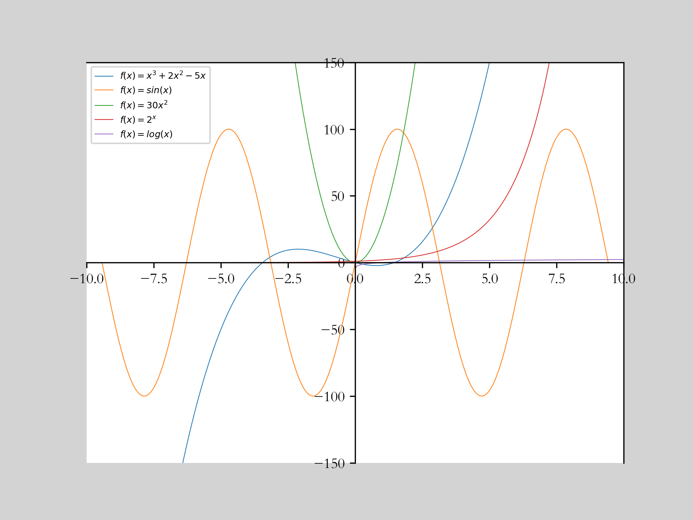

# 函数
定义：函数是将一个对象转化为另一个对象的`规则`。函数的`定义域`是输入集合，`上域`是所有可能的输出集合，`值域`是实际输出集合。
函数的前提：定义域中的每个输入都有唯一的输出，用函数图像表达就是满足`垂线检验`。
表达式：$f(x)=x^2$，$y$是函数值，$x$是自变量，$f$是函数名。
# 反函数
定义：将函数的值域转化为定义域的规则。
函数有反函数的前提：满足`水平线检验`。
表达式：$f^{-1}$。

# 复合函数
定义：将一个函数的输出作为另一个函数的输入。
表达式：$f(x)=h(g(x))$，$f$是外函数，$g$是内函数，计算顺序是先计算内函数，再计算外函数。也可以写成$f(x)=h\circ g(x)$。

# 奇函数和偶函数
定义：奇函数满足$f(-x)=-f(x)$，偶函数满足$f(-x)=f(x)$。
图像：奇函数关于原点对称，偶函数关于$y$轴对称。

# 线性函数
定义：$f(x)=ax+b$，$a$是斜率，$b$是截距。
点斜式：$y-y_0=a(x-x_0)$，$a$是斜率，$(x_0,y_0)$是已知点。

# 常见函数图像
## 多项式函数
定义：$f(x)=a_nx^n+a_{n-1}x^{n-1}+\cdots+a_1x+a_0$，$a_n$是最高次项系数，$a_0$是常数项系数。
### 二次函数
二次函数判别式：$b^2-4ac$，$a$是二次项系数，$b$是一次项系数，$c$是常数项系数。用来判定二次函数有几个解。
## 有理函数
定义：$f(x)=\frac{p(x)}{q(x)}$，$p(x)$和$q(x)$都是多项式函数。
## 指数函数
定义：$f(x)=a^x$，$a$是底数，$a>0$且$a\neq 1$。
## 对数函数
定义：$f(x)=\log_a(x)$，$a$是底数，$a>0$且$a\neq 1$。
性质：对数函数关于$y=x$对称，$a>1$时，函数图像在$y$轴右侧，$0<a<1$时，函数图像在$y$轴左侧。
## 三角函数
定义：$f(x)=\sin x$，$f(x)=\cos x$，$f(x)=\tan x$，$f(x)=\cot x$，$f(x)=\sec x$，$f(x)=\csc x$。
性质：三角函数关于$y=x$对称，$\sin x$和$\cos x$的值域是$[-1,1]$，$\tan x$和$\cot x$的值域是$(-\infty,+\infty)$，$\sec x$和$\csc x$的值域是$(-\infty,-1]\cup[1,+\infty)$

